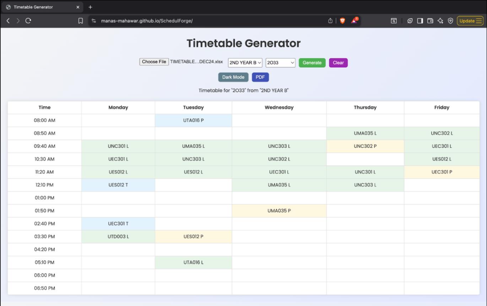
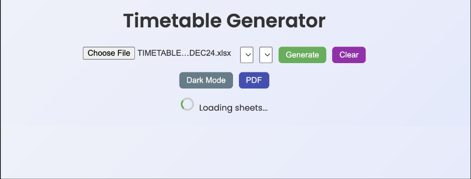
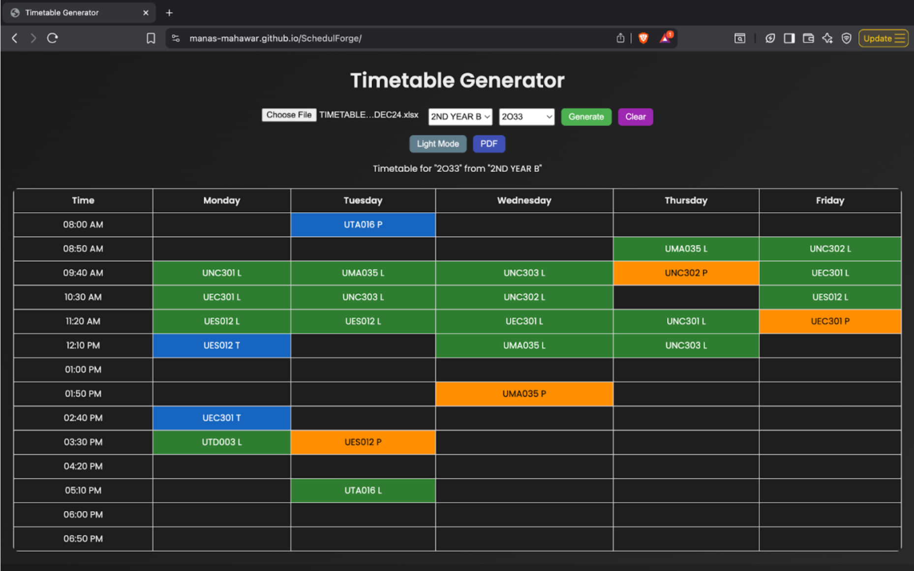
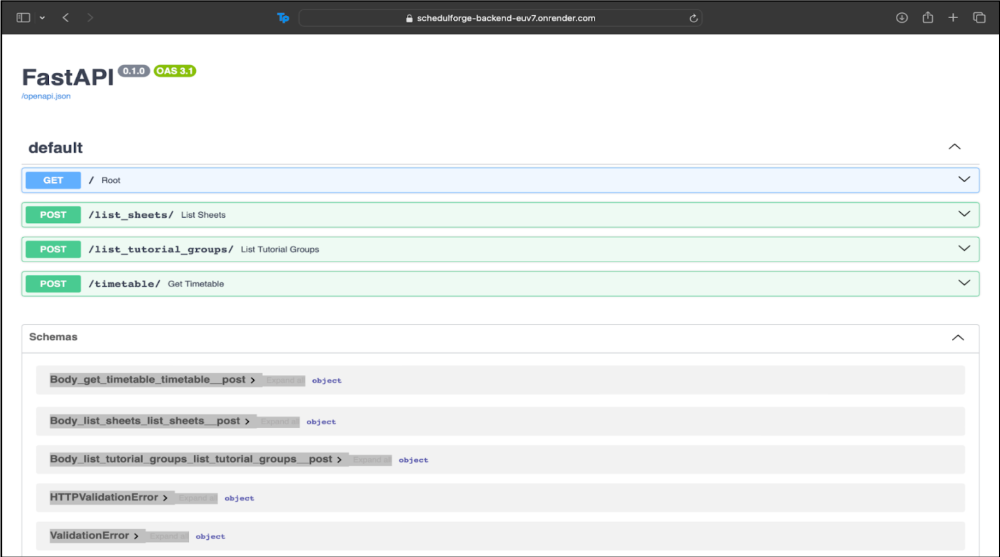
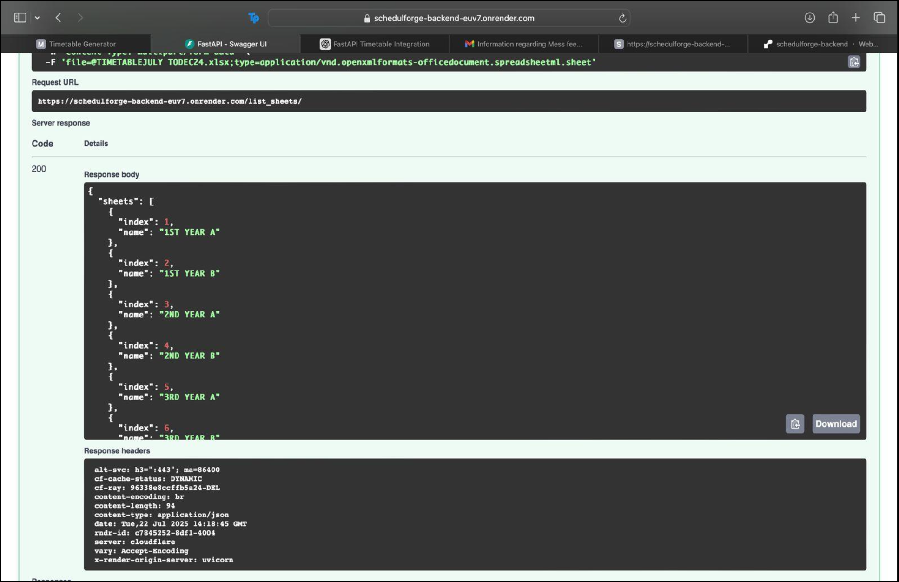
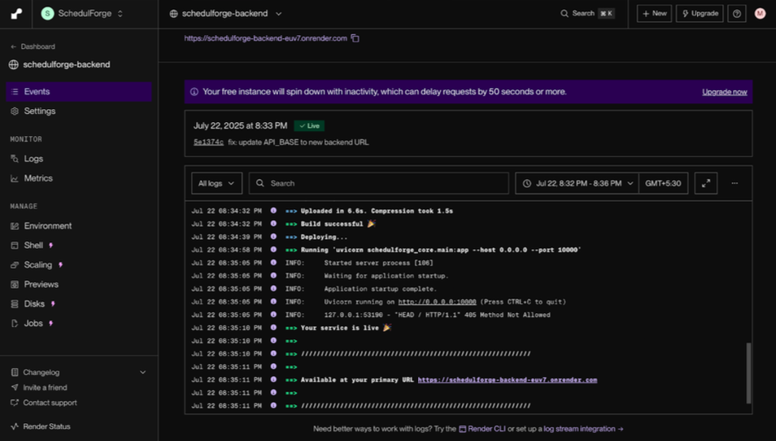

# SchedulForge

Automated timetable extraction system for complex and inconsistently structured Excel files.

Live Demo: https://manas-mahawar.github.io/SchedulForge
Backend API: https://schedulforge-backend-euv7.onrender.com

---

## Problem

University timetables are distributed as large Excel files with:

* Merged cells representing extended lectures
* Inconsistent tutorial group placement
* Irregular sheet structures
* Manual extraction required for each student

This makes timetable access time-consuming and error-prone.

---

## Solution

SchedulForge is a full-stack system that parses complex Excel files and generates structured, personalized timetables.

* Automatically detects tutorial groups
* Handles merged cells and irregular layouts
* Converts raw Excel data into structured JSON
* Provides an interactive web interface

---

## Demo

### User Interface


### Real-Time Status


### Dark Mode


### API Testing (Swagger)


### JSON Output


### Deployment Status


---

## System Architecture

### Backend

* FastAPI-based REST API
* Excel parsing using openpyxl
* Regex-based course detection
* Stateless processing (no data storage)

### Frontend

* HTML, CSS, JavaScript
* Dynamic timetable rendering
* PDF export using html2pdf.js

---

## Core Features

* Handles merged cells and multi-slot lectures
* Dynamic tutorial group detection
* Clean timetable visualization
* PDF export functionality
* Dark/light mode
* Fully browser-based usage

---

## Excel Parsing Logic

* Detects sheet and header dynamically
* Maps tutorial groups to correct columns
* Expands merged cells using openpyxl
* Uses regex to identify course codes
* Outputs structured timetable as:

```json
{
  "Monday": {
    "09:40 AM": "UCS301 P"
  }
}
```

---

## API Endpoints

| Endpoint               | Method | Description                  |
| ---------------------- | ------ | ---------------------------- |
| /list_sheets/          | POST   | Returns available sheets     |
| /list_tutorial_groups/ | POST   | Returns tutorial groups      |
| /timetable/            | POST   | Returns structured timetable |

Swagger Docs:
https://schedulforge-backend-euv7.onrender.com/docs

---

## Tech Stack

Backend: FastAPI, openpyxl, pandas, regex
Frontend: HTML, CSS, JavaScript
Deployment: Render (backend), GitHub Pages (frontend)

---

## Results

* Automated manual timetable extraction process
* Works on real-world Excel files from Thapar Institute
* Handles irregular structures without rigid assumptions
* Provides fast and reliable output

---

## Future Improvements

* Room number extraction
* Conflict detection and free-slot analysis
* Support for additional formats (.csv, .pdf)
* Mobile application
* User accounts and saved timetables

---

## Key Learning

* Full-stack system design
* Excel parsing with merged cell handling
* REST API development using FastAPI
* Deployment using Render and GitHub Pages
* Frontend-backend integration

---
